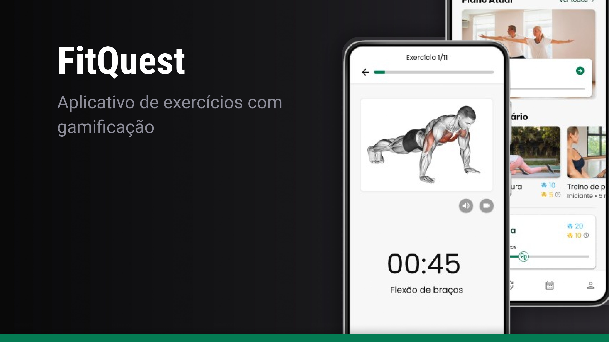

<a name="readme-top"></a>

<!-- PROJECT LOGO -->
<div align="center">
  <a href="https://github.com/DarkMetaK/fitquest-api">
    
  </a>
  
  <h3 align="center">Fitquest - API</h3>

  <p align="center">
    Aplicativo de atividades físicas com gamificação
  </p>
</div>

<!-- TABLE OF CONTENTS -->
<details>
  <summary>Sumário</summary>
  <ol>
    <li>
      <a href="#sobre">Sobre o projeto</a>
      <ul>
        <li><a href="#tecnologias">Tecnologias usadas</a></li>
      </ul>
    </li>
    <li>
      <a href="#como-rodar-o-projeto">Como rodar o projeto</a>
    </li>
    <li><a href="#contato">Contato</a></li>
    <li><a href="#agradecimentos">Agradecimentos</a></li>
  </ol>
</details>

<!-- ABOUT THE PROJECT -->
## Sobre

<a href="https://youtu.be/wAHg-hRq9i8">
    
</a>

## Sobre o projeto

Fitquest é um aplicativo que combina atividade física e recompensas para incentivar um estilo de vida mais saudável. Por meio de atividades como exercícios e caminhadas, os usuários acumulam pontos que podem ser trocados por cupons para sorteios de prêmios ou descontos em empresas parceiras.

O aplicativo foi desenvolvido com React Native para compatibilidade em sistemas Android e iOS, sendo projetado para oferecer uma experiência fluida e acessível, com design responsivo e interações intuitivas, garantindo que a usabilidade seja um ponto forte do projeto.

O back-end deste projeto foi desenvolvido com node, utilizando práticas modernas como <strong>Clean Architecture</strong>, <strong>Publisher/Subscriber</strong> e <strong>Test-Driven Development (TDD)</strong>. Sendo responsável por gerenciar funcionalidades essenciais, como o registro de atividades, cálculo de pontos e integração com parceiros para oferecer cupons e sorteios.

Para visualizar uma demonstração do uso e das funcionalidades, [clique aqui](https://youtu.be/wAHg-hRq9i8)

### Tecnologias usadas
[![Expo][Expo]][Expo-url]<br>
[![ReactNative][ReactNative]][ReactNative-url]<br>
[![TypeScript][TypeScript]][TypeScript-url]<br>
[![ReactQuery][ReactQuery]][ReactQuery-url]<br>

<p align="right">(<a href="#readme-top">Retornar ao topo</a>)</p>

<!-- GETTING STARTED -->
## Como rodar o projeto

1 - Clone o repositório
```sh
git clone https://github.com/DarkMetaK/fitquest-app.git
cd fitquest-app
```

2 - Instale as dependências do projeto.

```
npm i
```

3 - Configure as variáveis de ambiente
```sh
cp .env.example .env
```

4 - Execute a aplicação com o seguinte comando.
```sh
npm run start
```

<p align="right">(<a href="#readme-top">Retornar ao topo</a>)</p>

<!-- CONTACT -->
## Contatos
Matheus Porto - [LinkedIn](https://www.linkedin.com/in/matheusport0/) - [Website](https://darkmetak.vercel.app/) - matporto03@gmail.com

Link Repositório: [https://github.com/DarkMetaK/fitquest-app](https://github.com/DarkMetaK/fitquest-app)

<p align="right">(<a href="#readme-top">Retornar ao topo</a>)</p>

<!-- ACKNOWLEDGMENTS -->
## Agradecimentos
* [Best-README-Template](https://github.com/othneildrew/Best-README-Template)
* [Img Shields](https://shields.io)
* [Reanimated](https://docs.swmansion.com/react-native-reanimated/)
* [Skia](https://skia.org/)
* [Jest](https://jestjs.io/)
* [Patch-package](https://www.npmjs.com/package/patch-package)

<p align="right">(<a href="#readme-top">Retornar ao topo</a>)</p>

<!-- MARKDOWN LINKS & IMAGES -->
[Expo]: https://img.shields.io/badge/expo-1C1E24?style=for-the-badge&logo=expo&logoColor=#D04A37
[Expo-url]: https://expo.dev/

[ReactNative]: https://img.shields.io/badge/react_native-%2320232a.svg?style=for-the-badge&logo=react&logoColor=%2361DAFB
[ReactNative-url]: https://reactnative.dev/

[TypeScript]: https://shields.io/badge/TypeScript-3178C6?logo=TypeScript&logoColor=FFF&style=for-the-badge
[TypeScript-url]: https://www.typescriptlang.org/

[ReactQuery]: https://img.shields.io/badge/-React%20Query-FF4154?style=for-the-badge&logo=react%20query&logoColor=white
[ReactQuery-url]: https://tanstack.com/
